[Terug naar de Bio-informatica 1 hoofdpagina](../bio-informatics_1.md)

# Bio-informatica 1

## Basis computer vaardigheden
---

---

### Auteurs:
- Mark Sibbald
- Jeanine de Keyzer
- Jurre Hageman

### Versie:
3 april 2020

### Leerdoelen
Na deze les kun je:
-	Bestanden en folders structureren in een directory hiërarchie
-	Werken met zip-bestanden
-	Tekstbestanden lezen en schrijven
-	Werken met sneltoetsen
-	Bestanden en folders maken en delen via OneDrive
-	Bestanden zoeken
-	Een zoekquery schrijven in Google

### Les 1: Algemene computervaardigheden.

#### Het bestandsysteem directory structuur.
Een directory structuur is een manier waarop de bestanden en folders (directories) op een schijf vertoond worden aan de gebruiker. 
De root directory op Windows is meestal C:\. Bovenaan de structuur staat de root directory. Onderaan zijn door vertakkingen veel meer directories (ook wel folders genoemd) aanwezig. Een overzicht van een directory structuur is in Figuur 1 te zien.

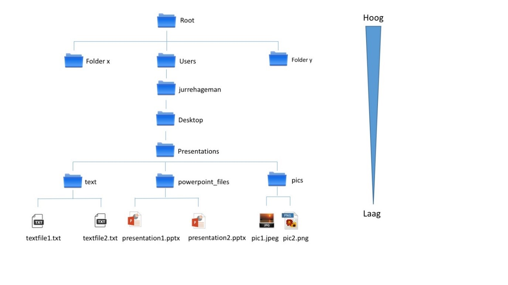
*Figuur 1. Directory structuur op een computer.*

Ook een Mac heeft een vergelijkbare structuur. De bestandsstructuur is te bekijken en te veranderen met het programma File Explorer (Finder op een Mac). Deze start je op door de Windows-toets (start knop) in te drukken gevolgd door File Explorer (Figuur 2A). Op een Mac gebruik je het icoontje voor Finder (Figuur 2B).

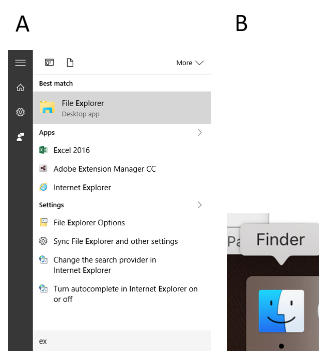
*Figuur 2. Opstarten File Explorer via de Windows-toets **(A)** en Finder op een Mac **(B)**.*

De File Explorer is nu geopend (Figuur 3):

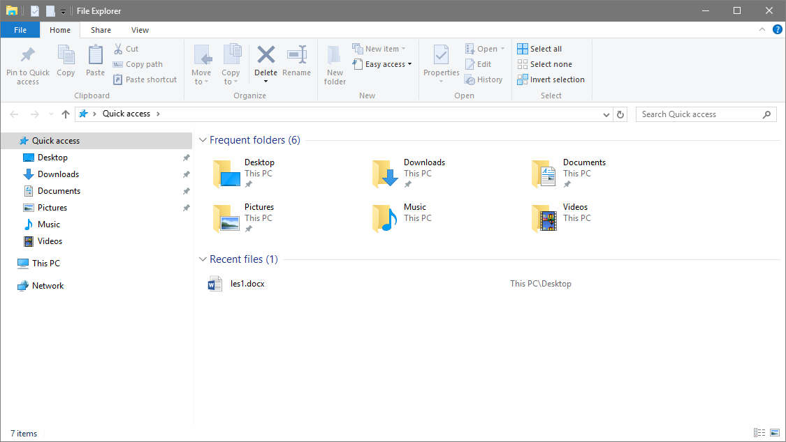
*Figuur 3. File Explorer geopend.*

Onder `This PC` zijn een aantal vaste folders aanwezig zoals Documents en Downloads. Een directory structuur wordt in Windows weergegeven door een schijfletter gevolgd door `:\`. Zo ontstaat er een directory pad. Het pad van de folder met tijdelijke bestanden is bijvoorbeeld: `C:\Temp\`. Het directory pad is in te zien door met de cursor in de titelbalk te gaan staan in de Explorer (rode pijl). Hier is een voorbeeld gegeven:

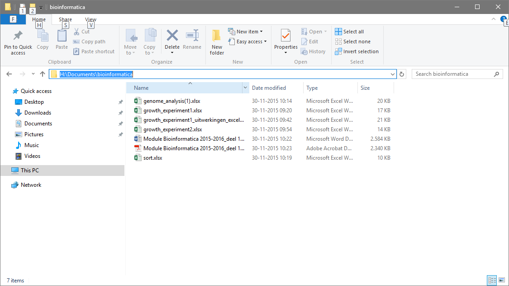
*Figuur 4. Het `directory pad`: de locatie van bestanden in de mappenstructuur.*

>Vraag 1: 
Geef het complete directory pad in het format C:\etc. van het bestand iexplore.exe. Zie Figuur 5 voor de locatie. Mocht je gebruik maken van een Mac, zoek dan naar het Arial Black.ttf bestand. Om het pad te krijgen kun je met de rechtermuisknop op het bestand klikken en kies vervolgens `Get Info`. Onder `Where` vind je het pad en kun je direct als antwoord kopiëren naar je antwoordenbestand.

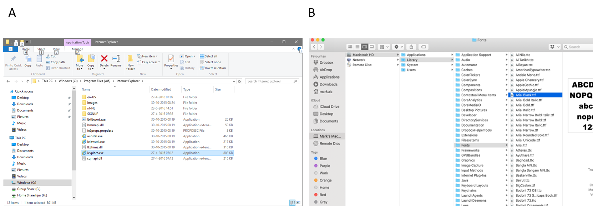
*Figuur 5. Locatie van het bestand **(A)** iexplorer.exe (Windows) en **(B)** Arial Black.ttf (Mac).*

Door een nette structuur aan te brengen in folders zijn bestanden makkelijker terug te vinden. In de File Explorer zijn folders aan te maken. 

Steeds meer studenten hebben in de loop van het jaar al een goede structuur met mappen op hun computer, maar als je dit nog niet hebt gedaan, maak een overzichtelijke directory structuur in de Documents folder. Maak hiervoor eerst een folder `school` met daarin 12 subfolders die thema01 t/m thema12 genoemd zijn. Zet in elk van deze folders weer een folder `practicum` en een folder `theorie`. 
TIP: Doe dit eerst voor de folder thema01, kopieer vervolgens deze folder nog elf keer en hernoem deze gekopieerde folders thema02 tot en met thema12. Deze folders bevatten nu ook elk twee folders (`practicum` en `theorie`). Verplaats bestanden die je tot nu toe gemaakt hebt naar deze folders. 

>Vraag 2:
Wat is de sneltoets om een folder aan te maken in de Explorer? Zoek dit op met behulp van Google. Ook voor Mac-gebruikers is er een sneltoets om een nieuwe map aan te maken in Finder. Geef het antwoord als de volgende voorbeeldnotatie: 
`Alt + Tab + q`

#### Bestandsnamen

Nu je een overzichtelijke directory structuur gemaakt hebt wordt het tijd om in wat meer detail te kijken naar bestanden. 
Namen van bestanden en folders in Windows zijn ongevoelig voor hoofdletters/kleine letters (`case insensitive`). PRESENTATIE1.pptx is dus hetzelfde als presentatie1.pptx.

Open Microsoft Word en maak een nieuw bestand en sla het bestand op als `tekst1.docx`. Maak vervolgens nog een keer een nieuw bestand en probeer het deze keer op te slaan als `TEKST1.docx`.

>Vraag 3: 
Welke melding krijg je te zien?
A.	Invalid character in filename
B.	You have no permission to save the file (on this location)
C.	Duplicate filename in folder, this operation will overwrite your previous file
D.	The file TEKST1.docx already exist

Sommige karakters worden niet toegestaan in folders en bestanden op Windows. Het Operating System van een Mac is daar iets soepeler in.

>Vraag 4: 
Maak een nieuw Word-bestand en probeer het op te slaan als \Hanze.docx (inclusief backslash `\`). Welke foutmelding krijg je (voor Mac en Windows ongeveer dezelfde melding)?
A.	Invalid character in filename
B.	You have no permission to save the file (on this location)
C.	Duplicate filename in folder, this operation will overwrite your previous file
D.	The file \Hanze.docx already exist

#### Bestandsextensies

Zoals je al gezien hebt bevatten bestandnamen van Word bestanden een punt (.) met daarachter `docx`. De letters achter de punt worden samen de extensie genoemd. In Windows wordt met behulp van extensie achterhaald met welk programma een bestand geopend moet worden. Verander de extensie van een bestand daarom nooit. Het operating systeem raakt dan de associatie met het juiste programma kwijt! Een uitzondering hierop zijn tekstbestanden (daarover later meer). Ook al wordt Word gebruikt voor het verwerken van tekst(en), deze bestanden worden niet onder tekstbestanden gerekend.

>Vraag 5: 
Probeer te achterhalen welke programma’s de volgende bestanden openen:
Match daarvoor de getallen met de letters en vul ze op de volgende manier in op het webformulier (met spaties tussen de combinaties): 1A 2B 3C 4D (dit is uiteraard niet het goede antwoord).

|Bestandsnaam|Programma|
|------------|---------|
|1. Bestandsnaam.pptx|A. Excel|
|2. Bestandsnaam.xlsx|B. Adobe Acrobat|
|3. Bestandsnaam.pdf|C. Word|
|4. Bestandsnaam.docx|D. PowerPoint|

Bestanden hebben een bepaalde grootte op de computer. De grootte van bestanden wordt weergegeven in bytes. Om de grootte van een bestand leesbaar te houden wordt de grootte vaak weergegeven in kilobyte (KB), megabyte (MB) en gigabyte (GB) (zie tabel hieronder).

|Eenheid|Omrekenen|
|-------|---------|
|byte|8 bit|
|kilobyte|1000 byte|
|megabyte|1*106 byte|
|gigabyte|1*109 byte|
|terabyte|1*1012 byte|
|petabyte|1*1015 byte|

De grootte van een bestand kan bekeken worden door in de File Explorer het bestand te selecteren, rechtermuisknop te klikken en dan `Properties` (`Get Info` op een Mac) te selecteren.

>Vraag 6:
Download het bestand `zairevirus.gb` van Blackboard. Hoe groot is dit bestand **precies** in bytes? Raadpleeg hiervoor `Size` en niet `Size on disk`. Geef alleen de cijfers als antwoord (ook de punt weglaten in je antwoord).

#### Zip-bestanden

Soms is het handig om verschillende bestanden en folders samen te bundelen tot een enkel bestand. We noemen een dergelijk bestand een archief. Een voorbeeld van een archief-bestandtype is het zip-bestand. Deze kun je maken door verschillende bestanden in de Explorer te selecteren en met de rechtermuisknop te klikken. Hierna kies je `Send to` en dan `Compressed (zipped) folder` (Figuur 6). Voor Mac is dit `Compress x items`.

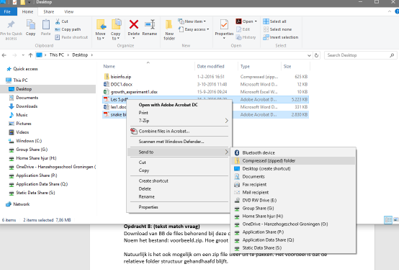
*Figuur 6. Maken van een zip-bestand.*

Het voordeel van een archief is dat je eindigt met één enkel bestand. Dit bestand kun je versturen als een attachment via mail. Een archiefbestand is bovendien gecomprimeerd wat betekent dat de grootte van het bestand op de harde schijf kleiner is.

>Vraag 7: 
Download van BB de bestanden behorend bij Vraag 7 en verpak ze tot een zip-bestand. Noem het bestand: ebola.zip. Hoe groot is de bestandsgrootte in bytes precies? Geef alleen de cijfers als antwoord (ook de punt weglaten in je antwoord).

Natuurlijk is het ook mogelijk om een zip-bestand weer uit te pakken. Het voordeel is dat de relatieve folder structuur gehandhaafd blijft. De individuele bestanden komen dus weer in een folder structuur.
Download het bestand test.zip van BB en pak het uit (unzip). Klik hiervoor met de rechtermuisknop op het zip-bestand, kies voor `Extract all` en kies een map waar je de bestanden in wilt zetten. Op een Mac kun je dubbelklikken op het bestand en dan wordt het zip-bestand direct uitgepakt en de bestanden in een map gezet. 

>Vraag 8:
Hoe heet het bestand in de diepste folder laag (staat in de folder met de meeste sub-folders)?

Vanaf les 2 worden de bestanden enkel in zip-bestanden aangeleverd. Het uitpakken van zip-bestanden is een van de vaardigheden die jullie moeten kunnen.

#### Tekstbestanden

Een bijzonder type bestand zijn tekstbestanden. Tekstbestanden worden in de biologie en met name de bioinformatica veel gebruikt. Veel apparaten waaronder DNA-sequencing machines genereren tekstbestanden. Tekstbestanden verschillen van binaire bestanden (in het feit dat elke byte voor een tekstkarakter staat, bij binaire bestanden kan elke positie elke denkbare bitcombinatie bevatten). Tekstbestanden zijn te openen met een tekst-editor zoals Notepad (Figuur 7). Notepad is te openen door op de Windows toets te klikken en Notepad te typen gevolgd door Enter.

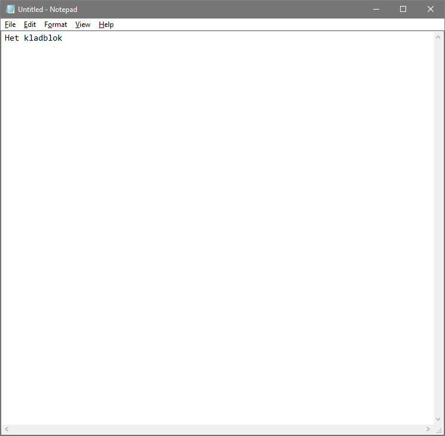
*Figuur 7. Openingsvenster van Notepad.*

Het is vaak moeilijk te zeggen of een bestand een platte-tekstbestand is. In de regel geldt dat als een bestand te openen is met Notepad en er zinnige woorden te onderscheiden zijn, dan is het een tekstbestand en geen binair bestand. Het maakt niet uit wat de bestandsextensie is van een tekstbestand. Zo is `ebola.txt` te openen met Notepad maar ook ebola.fasta of `ebola.gb`. 

>Vraag 9:
Download het zip-bestand `vraag9.zip` van Blackboard. Pak het bestand uit en open vervolgens elk bestand met Notepad. Welke bestand is een tekstbestand? Geef alleen een nummer als antwoord.

>Vraag 10:
Naast het openen van een tekstbestand is het ook belangrijk dat je de organisatie van een tekstbestand kan onderscheiden. Waarden in een tekstbestand zijn vaak gescheiden door een komma, een puntkomma (semi-colon), dubbele punt of een tab. Hoe zijn de waarden in bovenstaand bestand (tekstbestand van vraag 9) gescheiden?
A.	Komma
B.	Semi-colon
C.	Dubbele punt
D.	Tab

Verander ten slotte extensie van het tekstbestand. Klik met de rechtermuisknop op het bestand. Kies `Rename` en voeg de extensie `.txt` toe. Associeer vervolgens het programma Notepad met het openen van tekstbestanden. Dubbelklik hiervoor op het bestand. Kies het juiste programma (Notepad in dit geval) en selecteer `always use this app to open `.txt` bestanden`. 

#### Gebruik van sneltoetsen

Windows (en Mac) bevat een aantal nuttige sneltoetsen. Door hier gebruik van te maken kun je sneller met de computer werken. `Ctrl+c` en `Ctrl+v` (`Cmd+c` en `Cmd+v` voor Mac) ken je uiteraard al. Maar wat doen de volgende toetscombinaties?

>Vraag 11:
Wat doet `Alt + Tab`?
A.	Vergrendelt de PC
B.	Schakelt tussen vensters
C.	Laat de desktop zien
D.	Start een File Explorer (Finder voor Mac) op

>Vraag 12: 
Wat doet de `Windows-toets + d` (`Cmd + F3` voor Mac)?
A.	Vergrendelt de PC
B.	Schakelt tussen vensters
C.	Laat de desktop zien
D.	Start een File Explorer (Finder voor Mac) op

>Vraag 13:
Wat doet `Windows-toets + e` (`Cmd + N` voor Mac)?
A.	Vergrendelt de PC
B.	Schakelt tussen vensters
C.	Laat de desktop zien
D.	Start een File Explorer (Finder voor Mac) op

>Vraag 14: 
Wat doet `Windows-toets + l` (`Ctrl + Shift + aan/uit-knop` voor Mac)?
A.	Vergrendelt de PC
B.	Schakelt tussen vensters
C.	Laat de desktop zien
D.	Start een File Explorer (Finder voor Mac) op

#### OneDrive: delen van bestanden.

Elke student aan de Hanzehogeschool heeft 1 tB aan schijfruimte gekregen op Onedrive. Niet alleen is dat een hoop schijfruimte, OneDrive is ook een veilige manier om je bestanden op te slaan. Mocht je computer kapot gaan, gestolen worden etc. dan staan je bestanden nog steeds in `de cloud`. Bovendien kun je thuis ook bij deze bestanden en zo beschik je altijd over een actuele versie van je bestanden. Via OneDrive is het ook erg handig om een document te beginnen in Word Online waarmee je kan samenwerken met meerdere personen.
Maak nu eerst een folder `thema04` aan binnen OneDrive (Figuur 8).

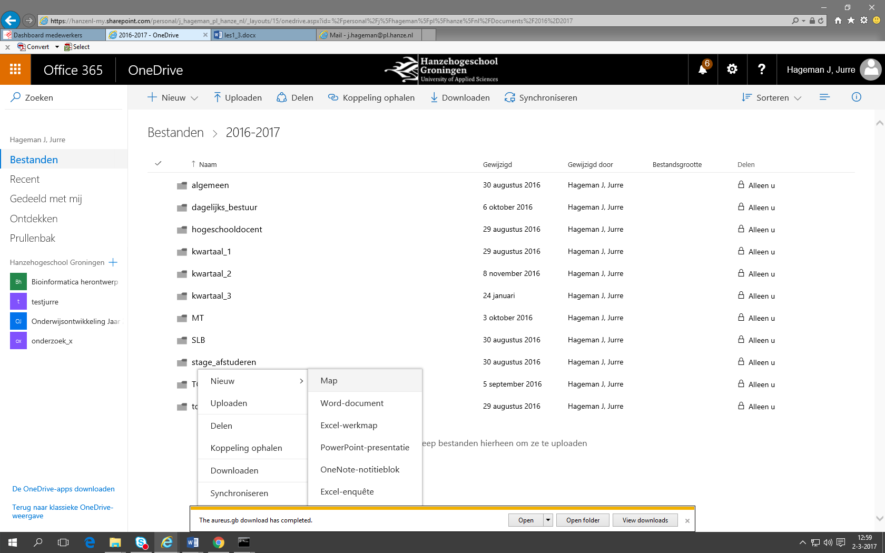
*Figuur 8. Nieuwe map maken in OneDrive.*

Navigeer naar deze folder en maak daarin een subfolder `les1` aan. Navigeer vervolgens naar deze folder. Maak een Word-bestand aan binnen de folder `les1` in OneDrive en type een stukje tekst. Geef je studentnummer als naam voor dit bestand (File > Save as > Rename). Deel het bestand met de docent (m.j.j.b.sibbald@pl.hanze.nl) door een deelbare link aan te maken (in de menubalk boven zit de knop 'Share') en het emailadres in te vullen (Figuur 9).  

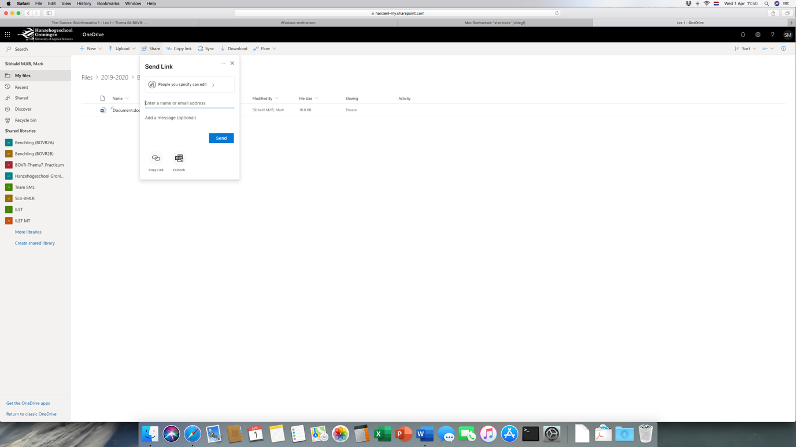
*Figuur 9. Delen van bestanden in OneDrive.*

Gebruik `Copy link` voor het antwoord op **vraag 15** en klik op `Send` om de link te versturen. 

>Vraag 15:
Geef als antwoord de link.

#### Delen van groot bestand via OneDrive

Omdat OneDrive veel opslagruimte biedt, is het erg geschikt om grote bestanden te versturen die niet via email verstuurd kunnen worden. Om een bestand te delen zijn leesrechten voldoende. De rechten kun je aanpassen door via `People you can specify can edit` (Figuur 10A) in het volgende scherm (Figuur 10B) `allow editing` uit te zetten.

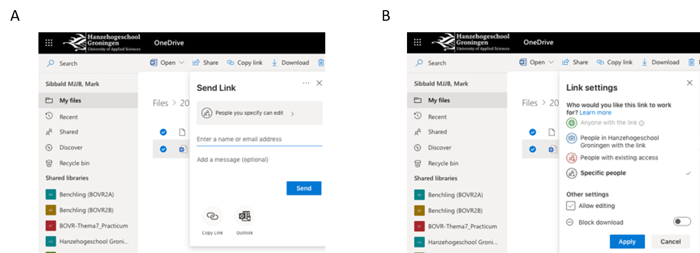
*Figuur 10. Rechten van gedeelde bestanden aanpassen **(A)** door `allow editing` aan of uit te zetten **(B)**.*

Je kunt nu een link maken naar het gedeelde bestand met leesrechten en deze link delen via de mail. Je kunt de aangepaste link kopiëren (`Copy`) en plakken in je bericht (Figuur 11).

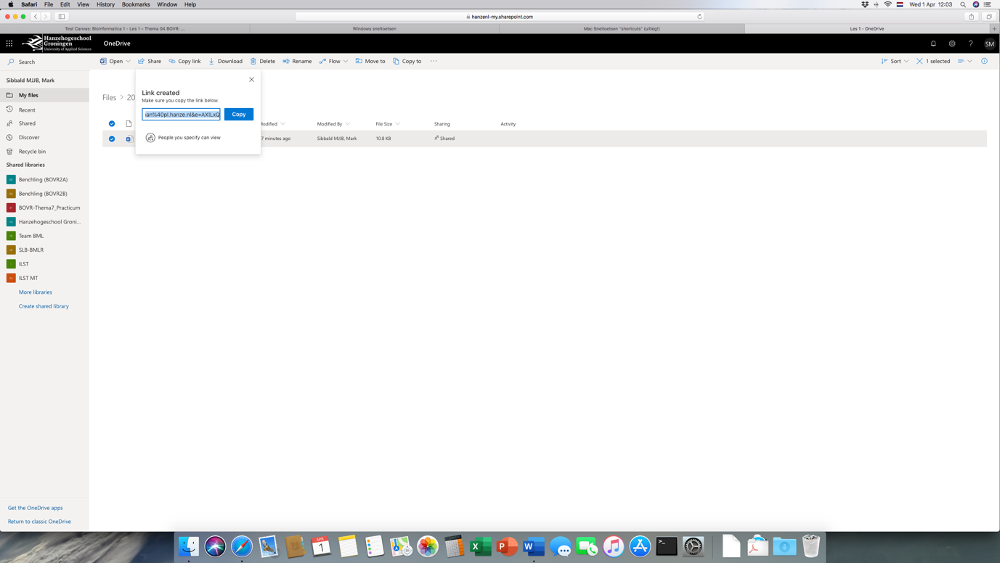
*Figuur 11. Link naar een gedeeld bestand kopiëren, zodat deze via mail gestuurd kan worden naar de personen die het bestand mogen bekijken.*

>Vraag 16:
Download het bestand van de volgende [link](NOG DOEN). Hoe groot is het bestand in MB? Geef alleen de cijfers als antwoord. Rond af op 1 cijfer achter de komma.

#### Zoeken naar bestanden en mappen 

Zoeken is in Windows 10 gemakkelijk gemaakt. De File Explorer heeft een zoekvak waar naar bestanden gezocht kan worden (Figuur 12).

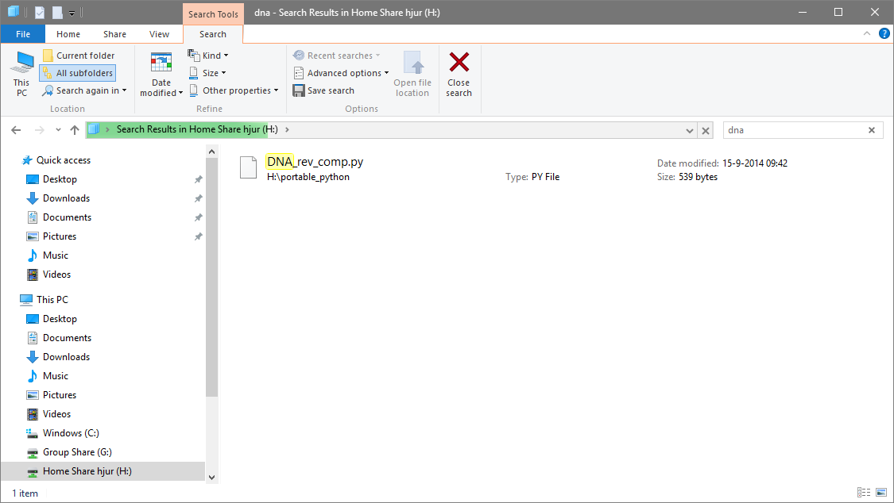
*Figuur 12. . Zoeken in de File explorer naar bestanden of mappen.*

Dit zoekvak geeft vaak goede zoekresultaten. Je zult echter merken dat als het aantal bestanden op je computer groeit, bestanden veelal lastiger te vinden zijn.
Daarom is het soms beter om een advanced search query te gebruiken. De Windows File Explorer ondersteunt de volgende zoek parameters (Figuur 13):
- date:
- datetaken:
- size:
- keywords:
- datemodified:
- kind:
- filename:

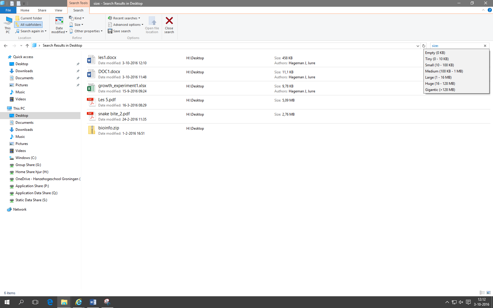
*Figuur 13. Zoeken in de File explorer met gedefinieerde parameters (in het voorbeeld `size:`).*

Om bijvoorbeeld bestanden te vinden die afgelopen week gemaakt kan bijvoorbeeld de zoekvraag `date:last week` als query gegeven worden.
Bij size kan bijvoorbeeld het keyword `Huge` gegeven worden.
De `*` fungeert als wildcard (elk teken waarvan er 0 of meerdere gegeven zijn). De zoekterm (query) filename: `*.docx` zoekt dus naar alle bestanden met een docx extensie. Daarnaast worden de Boolean operatoren `OR`, `NOT` en `AND` ondersteund.
Zie voor een overzicht van de Booleaanse algebra deze [link](https://nl.wikipedia.org/wiki/Booleaanse_algebra).

Ook op een Mac kun je met Finder zoeken naar bestanden. Om gerichter te kunnen zoeken (advanced search) kun je een zoekterm invoeren en vervolgens op de `+` (rechtsboven) klikken om specifieker te zoeken op bepaalde naam of type bestanden. De wildcard werkt hier niet, maar de Mac zoekt zowel in de naam als in het type bestand naar de zoekterm die je hebt ingevoerd. Bijvoorbeeld: als je zoekt op `pptx` wordt er gezocht naar bestanden met pptx in de bestandsnaam en naar PowerPoint-bestanden. Met de `advanced search` kun je aangeven dat je alleen naar PowerPoint-bestanden op zoek bent.

>Vraag 17:
Download het zip-bestand voor deze Vraag van Blackboard. Pak het uit en zoek in de folder vraag 19 naar het **kleinste** pptx-bestand. Wat is de naam van dit bestand (vergeet niet de extensie van het bestandstype toe te voegen)?

>Vraag 18:
Zoek in de folder vraag19 naar alle .jpg-bestanden. Hoeveel vind je er?

>Vraag 19:
Zoek naar de folder genaamd `bioinfo`. Hoeveel bestanden staan er in deze folder? Tip: je kan `Properties` (`Get Info` voor Mac) selecteren door op de rechtermuisknop te klikken.

Zoeken met Google  

Google is momenteel de meest gebruikte zoekmachine. Het zoekalgoritme van Google is bijzonder krachtig. Om het volledige potentieel te benutten is het echter wel belangrijk om iets af te weten van de Google zoektaal waarmee je een zoekopdracht kan uitvoeren (de zoeksyntax).
Voor een overzicht hiervan kun je [hier](https://support.google.com/websearch/answer/2466433?hl=en) de syntax vinden.

>Vraag 20: 
Zoek naar websites over lever OF kanker via Google.
Wat wordt je zoekterm (query) in het **Engels**? Gebruik alleen hoofdletters voor de Boolean operator die je gebruikt.

>Vraag 21: 
Zoek naar websites over lever EN kanker via Google.
Wat wordt je query in het Engels? Gebruik alleen hoofdletters voor de Boolean operator die je gebruikt.

>Vraag 22:
Zoek naar websites over genetische ziekten (in het Nederlands) waarbij genetische ziekten als één complete zoekterm (de twee woorden worden in deze volgorde achter elkaar gezocht) gebruikt wordt via Google (Voor een overzicht kun je [hier](https://support.google.com/websearch/answer/2466433?hl=en) de syntax vinden).
Wat wordt je query?

>Vraag 23: 
Zoek naar een filmpje over CFTR op de website Youtube via de Google.
Wat wordt je query?

### Tot slot
Lever je antwoorden in op Blackboard. 
Let er even op dat er achter de antwoorden geen spatie staat. Het nakijkscript rekent deze antwoorden namelijk fout.
Ga bij jezelf na of je de volgende leerdoelen hebt behaald:
-	Bestanden en folders structureren in een directory hiërarchie
-	Werken met zip-bestanden
-	Tekstbestanden lezen en schrijven
-	Werken met sneltoetsen
-	Bestanden en folders maken en delen via OneDrive
-	Bestanden zoeken
-	Een zoekquery schrijven in Google

---

[Terug naar de Bio-informatica 1 hoofdpagina](../bio-informatics_1.md)

---